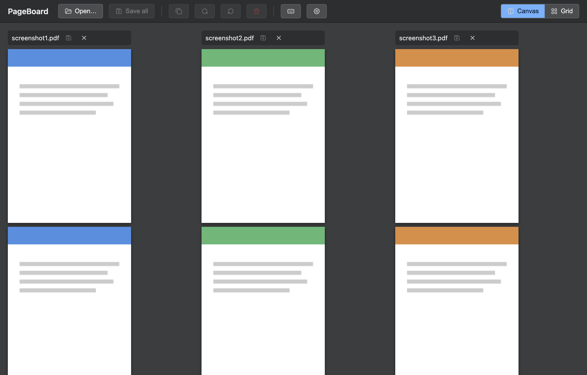
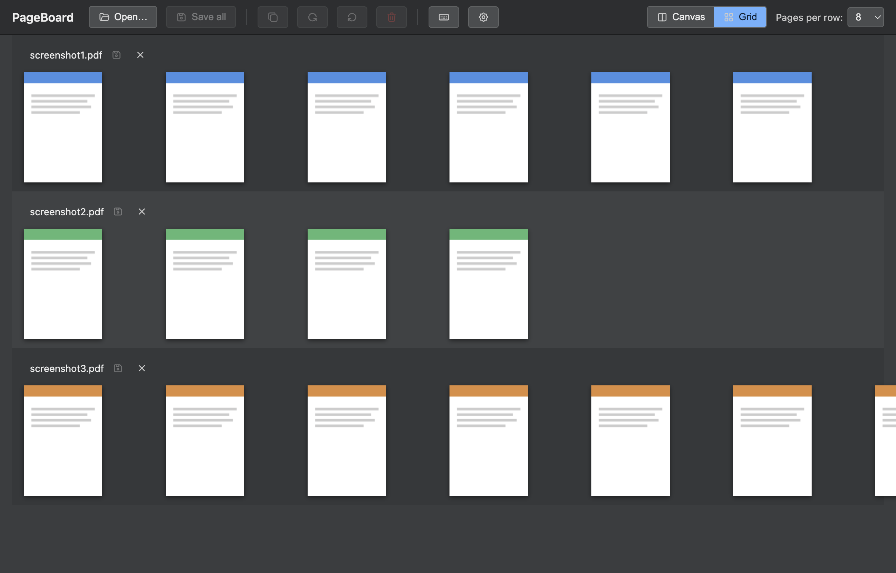

# PageBoard

Local desktop app (Mac & Windows) for **organizing multiple PDF files at
once**: reorder, delete, rotate, duplicate, and merge pages — across
documents on a shared canvas, as if all open PDFs were one single large
document. No editing of content/forms/annotations, purely focused on page
structure.

## Who is this for?

Single-document editing (rotate/delete pages, export from one PDF) is
already covered by PDF24, iLovePDF, Smallpdf, Acrobat, or Preview.app — you
don't need this tool for that. The difference is **seamless
multi-document editing**: several PDFs land together on one canvas and can
be reorganized against each other via drag & drop, as if they were one
single large document — pages stop "knowing" their original document
boundary once they're open. Built for people who regularly need to
sort/assemble several PDFs at once (e.g. scanned chapters, invoices, forms
from different sources) and don't want to upload each file separately to a
web tool — local, free, identical behavior on Mac and Windows.

## Screenshots

| Canvas mode | Grid view |
|---|---|
|  |  |

(Generated with placeholder content, not real documents.)

## Documentation

User documentation (how to actually use the app) lives in
[docs/](docs/README.md):

- [Getting Started](docs/getting-started.md)
- [View Modes](docs/view-modes.md)
- [Organizing Pages](docs/organizing-pages.md)
- [Saving & Undo](docs/saving-and-undo.md)
- [Keyboard Shortcuts](docs/keyboard-shortcuts.md)

## Feature set

All 18 phases of the internal implementation plan are complete:

- **Open**: multi-select file dialog, drag & drop from Finder/Explorer,
  detection of already-open files
- **Two view modes**: Canvas (per-document columns) and Grid (tile grid
  with adjustable column count), lossless switching between them
- **Virtualized rendering**: only visible pages are actually rasterized,
  even with many/large PDFs open at once
- **Zoom & pan**: anchored to the cursor position, plus focus mode
  (double-click a page)
- **Page selection** across documents: click, Shift+click (range),
  Cmd/Ctrl+click (toggle)
- **Drag & drop of pages** — within a document, between documents, or to
  the canvas edge (creates a new document)
- **Reorder whole documents** by dragging the section header, with a live
  preview
- **Page operations**: delete, 90° rotate, duplicate (context menu +
  keyboard shortcuts)
- **Save** overwrites the original file directly (no "save as"); empty
  documents can be restored or deleted on save
- **Undo/redo** for all page and move operations
- **Close** with a save/discard/cancel prompt for unsaved changes
- Robust error handling (corrupt/password-protected PDFs, missing
  permissions, …) instead of silent crashes
- Packaged `.dmg`/`.exe` builds via `electron-builder`, optional
  auto-update via GitHub Releases

## Development

Requires **Node.js 22 or newer** (only for `npm install`/development
tooling — the packaged app bundles its own Electron/Node runtime, so an
end user never needs Node installed at all).

```bash
npm install
npm start           # launch the Electron app
npm test            # run the tests (node:test)
npm run screenshots # regenerate docs/screenshots/*.png
npm run build        # package for the current platform (→ dist/)
npm run build:mac    # .dmg
npm run build:win    # .exe (NSIS)
```

`npm start` opens a window in an empty starting state (drop zone + "Open…"
button). PDFs can be opened via the button, via Cmd/Ctrl+O, or by dragging
them in from Finder/Explorer. To debug the main and renderer processes
together from VS Code, use the **"Electron: Main + Renderer"** launch
configuration (see `.vscode/launch.json`).

> **Note for the VS Code integrated terminal:** if `npm start` doesn't open
> a window, or `electron --version` prints a Node version instead of an
> Electron version, the culprit is the `ELECTRON_RUN_AS_NODE` environment
> variable inherited from VS Code. Fix: run without it —
> `env -u ELECTRON_RUN_AS_NODE npm start`.

## Tech stack

- **Electron** – shared codebase for Mac and Windows (bundles its own
  Chromium, so rendering behaves identically on both platforms)
- **pdf.js** – rendering/display
- **pdf-lib** – page mutation (delete, rotate, duplicate) and writing. Note:
  the upstream project has had no release in some time; it's watched rather
  than treated as actively maintained, since it runs in the main process
  (full filesystem access) on data from files the app didn't create
- Drag & drop – native HTML5 Drag and Drop API, no library (dnd-kit is
  React-specific and doesn't fit this bundler-free setup)
- **electron-builder** + **electron-updater** – packaging for `.dmg`/`.exe`
  and optional auto-update via GitHub Releases, built by GitHub Actions on
  every release tag

## Test PDFs

[pdf-files/test-files/](pdf-files/test-files/) contains sample PDFs for
manual and automated testing, mirrored from
[py-pdf/sample-files](https://github.com/py-pdf/sample-files) — see
[NOTICE.md](pdf-files/test-files/NOTICE.md) for licensing (CC-BY-SA-4.0,
distinct from this project's own MIT license). The files are **read-only**
so a save from the app can't accidentally overwrite them.

For testing the save flow (save/restore original/delete empty documents),
use `pdf-files/test-files-edit/`: writable copies of a few sample files,
kept in one central place instead of scattered ad-hoc copies. Deliberately
not version-controlled (`.gitignore`), since the app modifies/deletes them
during testing — just recopy from `pdf-files/test-files/` if needed.

`npm run screenshots` regenerates the two screenshots above from the PDFs in
[pdf-files/screenshot-files/](pdf-files/screenshot-files/).

## Contributing

Contributions are welcome — see [CONTRIBUTING.md](CONTRIBUTING.md) for
setup, test strategy, and the project's scope.

## License

[MIT](LICENSE) – open-source project, no monetization planned. Third-party
licenses are listed in [ACKNOWLEDGMENTS.md](ACKNOWLEDGMENTS.md).
